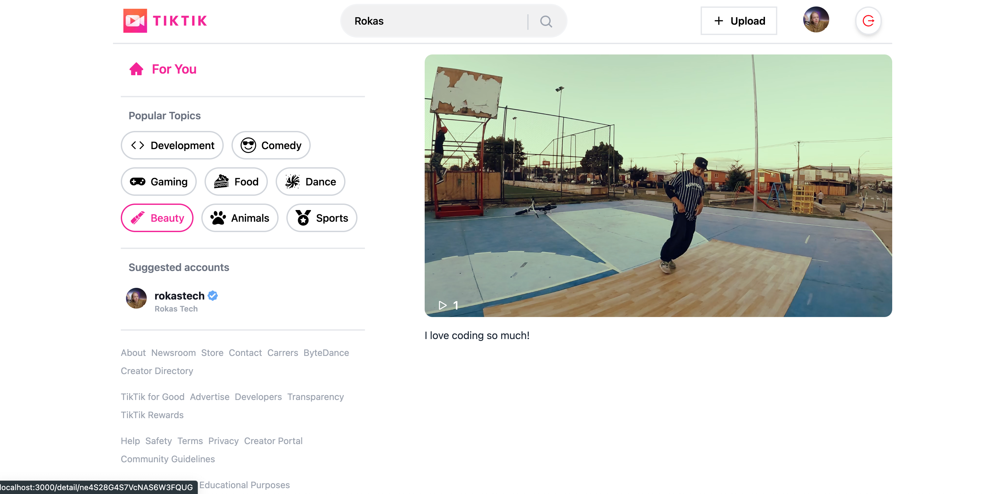

# Video Sharing Platform (VSP)

This is an open source video sharing platform. It is a web application that allows users to upload videos and share them with other users. It is built using the Next JS 13 framework 
and has some of the following features:
- User authentication
- Video upload
- Video sharing
- Video search
- Video comments
- Video likes
- Video dislikes
- Video views
- Video watch history
- Video watch later
- Video playlists
- Video subscriptions
- Video recommendations
- Video trending
- Video categories
- Video channels
- Video notifications

## Getting Started

To get started, you need to have the following installed on your machine:
- Node JS
- Yarn
- MongoDB
- Redis

### Installation
``yarn dev or npm run dev``

### Build
``yarn build or npm run build``

### Production
``yarn start or npm run start``

## Contributing
In the future, I will be adding a contributing guide.
